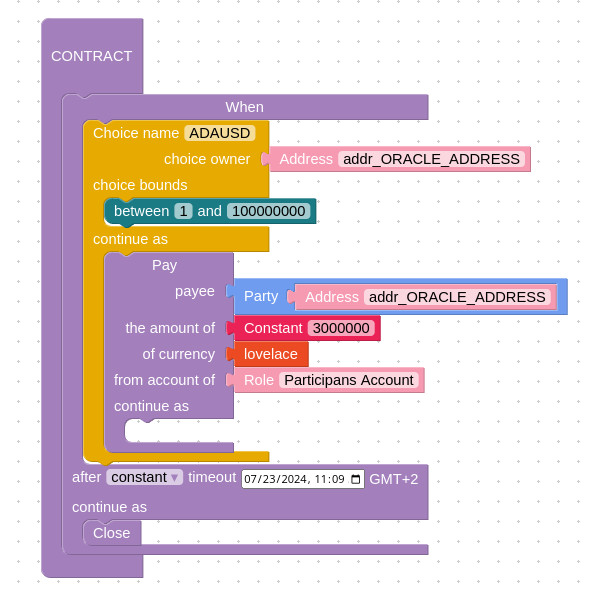

## Marlowe Oracle Protocol

In this article, we explore how oracles interact with Marlowe contracts transparently, ensuring all parties have a clear understanding of the contract logic and the data used for decision-making. This protocol employs a "pull" architecture, where the contract requests data from the oracle, which in turn responds with the requested information. Additionally, oracles can easily detect if a given contract compensates them for the data provided.

## Detecting Marlowe Data Requests

The Marlowe language is designed to be restrictive and structured, enabling programmatic assessment of many properties of the written programs. Large segments or entire contracts are visible on-chain in the UTxO `datum`, allowing observation, detection, and analysis of these visible parts. This context supports the development of unique "pull" (or request-response) architectures with the Marlowe language.

### Execution of Marlowe Contracts on the Chain

Marlowe contracts are easily identifiable on-chain as they distinctly separate the interpreter, represented as a spending validator, from the code encoded in the datum. The validator hash is well-specified, and platforms like cardanoscan or marlowescan.io, along with tools like Marlowe Runtime, assist in detecting UTxOs representing valid Marlowe contracts.

Every UTxO on the chain has three components:
  * **Address**: Either a wallet or a script address managing this particular UTxO
  * **Assets**: A set of assets, including ADA and any other tokens managed by this UTxO
  * **Datum**: An optional data piece used to mark the UTxO or to store data for the smart contract

In the case of Marlowe, the structure and values of all these components are well-defined.


A critical detail to emphasize is that Marlowe contracts typically await inputs from participants. When a valid input is provided, the contract progresses to its conclusion or the next suspension point where it may await further input.

Thus, when a transaction consumes a Marlowe UTxO, it must provide in the redeemer a valid input that fulfills the contract requirements:
  * It must be provided by an authorized party, verified through transaction signatures.
  * The value must be valid from the contract's perspective, as defined by the contract's valid range of values.


## Oracles and Marlowe

### Why Marlowe?

#### Safety and Simplicity

Marlowe's contract semantics are relatively straightforward and predictable. Many pain points for DApp builders have been resolved by the provided software, and the interpreter itself has been fully audited. This makes Marlowe an excellent choice for constructing financial contracts, with oracles fitting seamlessly into this framework. The triad of Marlowe's on-chain interpreter, the datum, and assets facilitates easy detection of valid Marlowe contracts on-chain, bolstered by the guarantees provided by the language.

#### Language Accessibility and Ecosystem

While the Marlowe project is not new, widespread adoption of the technology is still emerging. Recent critical and developer-focused additions to our tooling and infrastructure have sparked growing interest in the language.

Here’s a quick overview of our ecosystem, which also facilitates easy interaction because Marlowe provides tools and software that aid in designing, analyzing, deploying, executing, and interacting with contracts:

  * **Marlowe TS-SDK**: TypeScript SDK for building and interacting with Marlowe contracts, featuring a friendly and high-level API.
  * **Marlowe Runtime**: A custom backend with an indexer and transaction builder, exposing a REST API that handles all indexing and transaction-building needs for the user – minimal UTxO knowledge is required to start building DApps with it.
    * Ready-to-use instances are available on the testnets: [Marlowe Runtime Testing Infrastructure](https://github.com/marlowe-lang#new-testing-infrastructure)
    * We will provide an example implementation of both the oracle request scanner and the contract builder (DApp component) in TypeScript in the following section, which will utilize this backend.
  * **Marlowe Scanner**: A small web app useful for detecting and debugging Marlowe contracts on-chain: https://marlowescan.com
  * **Marlowe Runner**: A small and simple web app that exposes tools for deploying and interacting with the contract: https://preprod.runner.marlowe-lang.org
  * **Marlowe Playground**: A simple web based IDE for learning the basic concepts of Marlowe and building simple contracts: https://playground.marlowe-lang.org

### Paid Oracle Requests in Marlowe

From a data provider's perspective, establishing a clear and user-friendly protocol is essential. It should be easy to harvest and analyze data requests, as well as to formulate and validate them from a data consumer's standpoint. Both parties involved in this exchange will also benefit from a transparent payment flow for the Oracle service and the flexibility around safety, so the level of redundancy could be an extra and independent option.

Marlowe excels in meeting these requirements and provides mainly...

**TBC - Summary**:
    * A single oracle request can be encapsulated as a piece of Marlowe containing two steps: a choice made by the oracle and payment for its service.
    * This piece of Marlowe can be easily filtered out from the chain using Marlowe Runtime API and TS-SDK client.

```
When
  [Case
    (Choice
      (ChoiceId "ADAUSD" (Address "addr_ORACLE_ADDRESS"))
      [Bound 1 100000000])
    (Pay
      (Role "Participants Account")
      (Party (Address "addr_ORACLE_ADDRESS"))
      (Token "" "")
      (Constant 3000000)
      <THE REMAINING OF THE CONTRACT LOGIC>)
  ]
  1721725763504 Close
```
TBC



---

This refined version should enhance readability and clarity while maintaining the technical depth and structure of your original markdown document.
