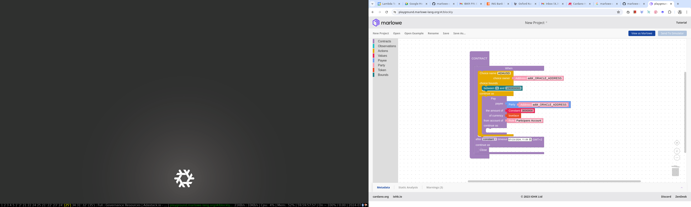

## Marlowe Oracle Protocol

In this article we will explore how oracles can interact with Marlowe contracts in a transparent way so all involved parties can have a clear understanding of the contract logic and the data that is being used to make decisions. This protocol is based on the idea of a "pull" architecture where the contract requests data from the oracle and the oracle responds with the requested data. Additionally oracles can easily detect if a given contract pays them back for the data they provide.

## Detecting Marlowe Data Request

Marlowe language is by design restricted and structured in such a way that many properties of programs written in it can be programaticaly assessed. Additionally either full or large chunks of a contract are present on the chain in the UTxO `datum` which makes it possible to observe, detect and analyze at least this visible parts.
This context allows us to build a pretty unique "pull" (or request-response) based architectures with Marlowe language.

### Execution of Marlowe Contracts on the Chain

Marlowe can be easily detected on the chain because it clearly separates interpreter which is represented and provided as a spending validator and the code which is encoded in the datum. The validator hash is well specified and some platforms like cardanoscan or marlowescan.io and tools like Marlowe Runtime can help detect UTxOs which are valid Marlowe contracts.

Every UTxO on the chain have three pieces:
  * An address - either wallet or script address which manages this particular UTxO
  * Assets - a set of assets ADA and any other tokens which are managed by this UTxO
  * Datum - an optional piece of data which can be used to mark the UTxO or to store data for the smart contract

In the case of Marlowe structure and values of all this pieces are well specified.


A really important detail which we should ephasis here is that Marlowe in most cases awaits for some input to be provided by the participants. When a given input is provided and it is valid Marlowe input the contract progresses to the endo or to the next suspension point where it possibly awaits for another user input.

So when a transaction consumes Marlowe UTxO it has to provide in the redeemer a valid input (in Marlowe terms) which fullfils the contract requirements:

  * It has to be provided by appropriate party - authorization can be done through transaction signature.
  * A given value has to be valid from the contract perspective - contract defines valid range of the value.


### Marlowe Encodes Request

TBC

```
When
  [Case
    (Choice
      (ChoiceId "ADAUSD" (Address "addr_ORACLE_ADDRESS"))
      [Bound 1 100000000])
    (Pay
      (Role "Participans Account")
      (Party (Address "addr_ORACLE_ADDRESS"))
      (Token "" "")
      (Constant 3000000)
      <THE REMAINING OF THE CONTRACT LOGIC>)
  ]
  1721725763504 Close
```
TBC


